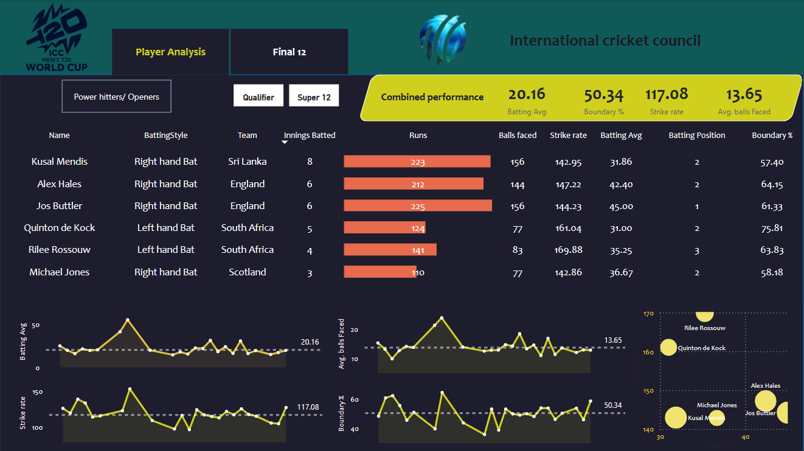

# 🏏 ICC T20 World Cup Player Analysis Dashboard

This Power BI dashboard presents a deep dive into player performance during the **ICC Men's T20 World Cup**, with a focus on **power hitters** and **openers**. It allows for quick comparison of batting efficiency and consistency across teams.

## 📸 Dashboard Preview

### 🔗 View Live Dashboard  
👉 [Click here to explore the full interactive Power BI report](https://app.powerbi.com/groups/me/reports/67775629-d2dc-427d-bd7d-cd1da0482669/a6ee22ee01b5aaa23291?experience=power-bi)

---

## 🚀 Features

- 🎯 Filter players by phase: *Qualifier* vs *Super 12*
- 🔁 Toggle between *Power Hitters / Openers*
- 📊 Key stats per player:
  - Runs scored
  - Balls faced
  - Batting average
  - Strike rate
  - Boundary percentage
  - Batting position
  - Average balls faced per innings
- 📈 Interactive visuals:
  - Horizontal bar charts
  - Line trend charts with benchmarks
  - Scatter plot for performance clustering

## 🔍 Key Insights

- Compare players by **impact metrics** like boundary % and strike rate.
- Analyze player consistency with **batting average trends**.
- Identify **high-risk/high-reward players** and consistent anchors.

## 🛠️ Built With

- **Power BI Desktop**
- DAX for custom calculations:
  - `Boundary % = (Boundaries / Balls Faced) * 100`
  - `Avg Balls Faced = Balls Faced / Innings Batted`
- Custom themes and bookmarks for interactive experience

## 📁 Project Structure

├── t20ICCMenSnip.png      # Dashboard screenshot
|
├── ICC_T20_WorldCup.pbix  # Power BI file (optional for repo)
|
└── README.md              # Project description
